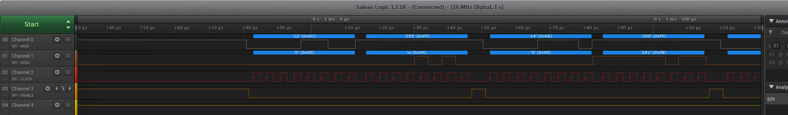

# AS2p
E0009E Automotive Systems 2: Parallel version

A car is not anymore just a mechanical system anymore.
It is a mechatronic system of systems with electrical and electonic systems on a chassis.
(With connections to the Internet, it becomes a cyber phyrical system (CPS).)
The advantage added by the electronics is that several inputs can be used to make the correct decision about a process.
For example, an engine air fuel mixture does not depend only on RPM but also ambiant air temperature, pressure, engine temperature,...

The aim of this course is to enpower a student to understand and maybe design both the hardware and software in these mechatronic systems.
We use an old processor to flaten the learning curve.
It is only at the end of the course that we introduce micro controllers and systems on chip.

The text below this line in this README file is updated with each commit to enable a student to navigate rapidly between the diffent branch and commits.

# Version's aim

* The purpose of this version is to use SPI to communicate with the on board accelerometer chip.
This code is an example to use the 3D accelerometer found on the lower right of the board.
MMA7455L Freescale +-2g/4g/8g Three Axis Low-g Digital Output Accelerometer.
This code requires 1 jumper for the chip select (JP15).
* We also the idea of structures to group related variables

## Exercises
- Can you see the clock cycles on the oscilloscope? See figure below
-  How would you detect a negative acceleration versus a positive one?

## Wiring
You will need only one wire between Slave or Chip Select (JP12) and the the accelerometer (JP15).
Why do you not need to wire MOSI, MISO, and SPI Clock?
