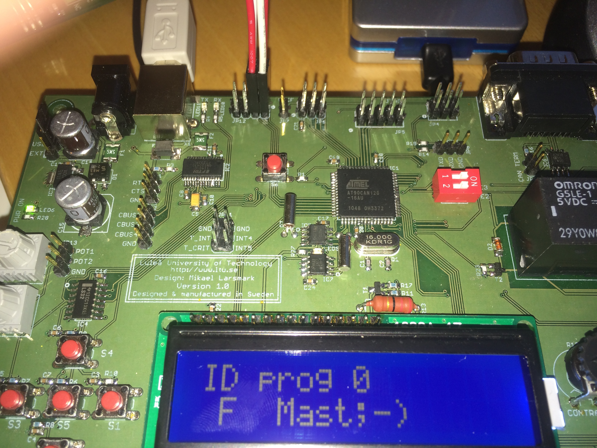

# AS2p
E0009E Automotive Systems 2: Parallel version

A car is not anymore just a mechanical system anymore.
It is a mechatronic system of systems with electrical and electonic systems on a chassis.
(With connections to the Internet, it becomes a cyber phyrical system (CPS).)
The advantage added by the electronics is that several inputs can be used to make the correct decision about a process.
For example, an engine air fuel mixture does not depend only on RPM but also ambiant air temperature, pressure, engine temperature,...

The aim of this course is to enpower a student to understand and maybe design both the hardware and software in these mechatronic systems.
We use an old processor to flaten the learning curve.
It is only at the end of the course that we introduce micro controllers and systems on chip.

The text below this line in this README file is updated with each commit to enable a student to navigate rapidly between the diffent branch and commits.

# Version's aim
In this commit, we introduce SPI to enable communication between two boards.
We also the dip switches to set one board as a Master and the other as Slave.
The ADC value in measured on the Master and sent to the Slave when both are in SPI mode or state.
(A bug was addressed with the itoa function where the length of the whole array has to be passed to the function).

## Exercises
- What does SPI stand for?
- Can you see the clock cycles on the oscilloscope?
- Can you send bytes from the *textLine* array?
- Using the GPIO on JP11, can you select other boards?

## Wiring
You will need to add wires between your boards.
The SPI jumper is JP12 at the top of the board.
MOSI, MISO, SPI Clock and Chip Select are required.
